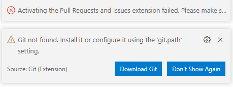
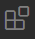

# 💻 PROJECT: TN1 - Github en VS Code

## 🥅 Overzicht en Leerdoelen

Met dit project installeer je de belangrijkste hulpmiddelen van het vak Informatica, zoals een Source Control System (met Github) en een code editor (met Visual Studio Code).

## 🔍 Het Vak Informatica

In het vak Informatica zal je programma's leren maken, databanken maken en beheren, websites ontwikkelen, ... Dit doe je aan de hand van projecten. Een project bestaat vaak uit meerdere documenten waar je code in schrijft. Het is heel belangrijk dat je deze projecten kunt bewerken, opslaan en delen.

### Visual Studio Code

Een **tekst editor** is simpelweg eender welk programma waarmee je tekstbestanden kan aanpassen.\
Een **code editor** is een tekst editor waarmee je gemakkelijk code kunt schrijven. Je kan zelf geen opmaak toevoegen, maar een goede code editor zal jouw code automatisch van opmaak voorzien om de code meer leesbaar te maken.

**Visual Studio Code** (*afgekort: VS Code*) is een gekende, professionele code editor. Heel handig aan VS Code is dat je **extensies** kan toevoegen: kleine uitbreidingen die je kunnen helpen bij het schrijven van code. **Ga zeker zelf op zoek naar extensies die jij handig vindt!**

Enkele voorbeelden van handige extensies:
 - [Markdown All in One](https://marketplace.visualstudio.com/items?itemName=yzhang.markdown-all-in-one)
 - [Bracket Pair Colorizer](https://marketplace.visualstudio.com/items?itemName=CoenraadS.bracket-pair-colorizer)
 - [Live Server](https://marketplace.visualstudio.com/items?itemName=ritwickdey.LiveServer)

Enkele voorbeelden van grappige/leuke extensies:
 - [Power Mode](https://marketplace.visualstudio.com/items?itemName=hoovercj.vscode-power-mode)
 - [Password Generator](https://marketplace.visualstudio.com/items?itemName=ftonato.password-generator)
 - [Polacode](https://marketplace.visualstudio.com/items?itemName=pnp.polacode)

> #### OPDRACHT: Visual Studio Code (1)
>
> - [ ] installeer VS Code door **bovenaan deze pagina** op de knop  te klikken.
> - [ ] volg de installatieprocedure.

> #### OPDRACHT: Visual Studio Code (2)
> - [ ] wanneer je je project opent in VS Code krijg je nu een foutboodschap te zien:\
>       \
>       Klik op de knop "Download Git".
> - [ ] installeer Git. Let tijdens de installatieprocedure op de volgende twee stappen:\
>       **BELANGRIJK**: kies tijdens de installatie voor VS Code als "default editor"\
>       **BELANGRIJK**: Kies voor "Use Windows' default console window"\
>       al de rest mag je de standaard waardes kiezen.

> #### OPDRACHT: Visual Studio Code (3)
>
> - [ ] open VS Code en klik links op de knop .
> - [ ] kijk na of de extensies "Github Classroom" en "Github Pull Request and Issues" reeds zijn geinstalleerd.
> - [ ] zoek en installeer de volgende extensies:
>   - Live Server
>   - Live Share
>   - Markdown All in One

### Github

**Git** (*NIET* te verwarren met Github) is een **Version Control System (VCS)**. Een VCS is een programma waarmee je verschillende documenten van een project kunt beheren, zodat je gemakkelijk de veranderingen in het project kunt volgen. Wanneer er iets misgaat, geeft een VCS de optie om terug te gaan naar een vorige versie van het project. 

**Github** is een website waar je Git kunt gebruiken voor jouw projecten in een gemakkelijk te gebruiken overzicht. Deze website werkt als volgt:

 1. je maakt een **repository** aan. Dit is een plek op Github waar je alle bestanden van je project zult bewaren. 
 2. Wanneer je een repository hebt gemaakt, kan je bestanden bewaren met behulp van 2 Git commando's:
    1. Je **commit** één of meer bestanden: hiermee geef je aan dat deze bestanden "klaar" zijn om verstuurd te worden.
    2. Je **pushed** één of meer commits: hiermee verstuur je alle bestanden die je hebt gecommit naar je repository.

Om het werken met Git en Github gemakkelijker te maken, heeft Github een programma gemaakt waarmee je de projecten op je computer gemakkelijk kan uploaden en downloaden naar Github. Dit programma heet **Github Desktop**.

> #### OPDRACHT: Github (1)
>
> - [X] Maak een Github account aan met het e-mail adres van de school (voornaam.achternaam@leerling.piustien.net).\
>       ***Hint**: Als je deze opdracht leest, dan ben je normaal gezien reeds aangemeld op je Github account!*

> #### OPDRACHT: Github (2)
> - [ ] Download en installeer [**Github Desktop**](https://desktop.github.com/).
> - [ ] Open Github Desktop en log in met je Github account.
> - [ ] Gebruik Github Desktop en **clone** dit project.\
>       **clone** is een Git commando waarmee je een Git project download op je computer.

---

## 💡 Belangrijke Termen

| Term         | Definitie                                                                    |
| ------------ | ---------------------------------------------------------------------------- |
| repository   | een opslagplaats op Github waar je de bestanden van een project kunt opslaan |
| commit       | een Git-commando waarmee je bestanden klaarmaakt om verstuurd te worden      |
| push         | een Git-commando waarmee je commits verstuurd                                |
| tekst editor | een programma waarmee je tekstbestanden kunt aanpassen                       |
| code editor  | een tekst editor waarmee je gemakkelijk code kunt schrijven                  |

## 📚 Bronnen

 - [VS Code](https://code.visualstudio.com/download)
 - [VS Code Extensions](https://marketplace.visualstudio.com/VSCode)
 - [github.com](https://github.com/)
 - [Github Desktop](https://desktop.github.com/)
 - [Git](https://git-scm.com/downloads)
